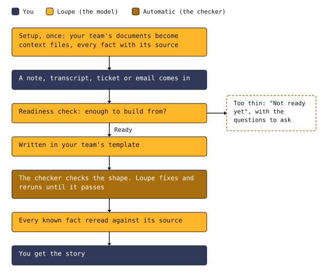

<p align="center">
  <picture>
    <source media="(prefers-color-scheme: dark)" srcset="brand/lockup-dark.svg">
    
  </picture>
</p>

<p align="center"><b>Story tools help you write faster. Loupe won't hand you a story it can't back up.</b></p>

Loupe is a Claude skill for product managers. It turns meeting notes, tickets and emails into stories a developer can build without a second meeting. Product owners and product managers write with it. Developers, testers and anyone else who reads a story get one that says what's known, unknown and assumed.
It runs in Claude, or in Claude Code, where it reads the team's context from your repository, can search your tracker before writing, and can create a ticket from a finished story with your approval.

Jump to [setup](#setup), [an example story](#what-a-story-looks-like), [what the trials changed](#what-the-trials-changed), [how it works under the hood](#under-the-hood), or [how it was built](#how-it-was-built).

## Why it exists

A story can look done and still hide what nobody knows: a rule no one checked, a screen no one described, a number with no source. The developer finds the gaps halfway through the build, and the team books a second meeting to fill them. Loupe puts those gaps on the page before anyone starts.

## What a story looks like

Every story opens with three lines: the call (written, or not ready yet), how confident Loupe is, and the question to ask before anything else.

> Call: Story written<br>
> Confidence: Medium, who, what, where and the cutoff are clear, but billing for a moved box is untested.<br>
> First question: Does skipping count as a payments change under the December freeze, since it affects charging?
>
> **Test scenarios**
>
> TEST SCENARIO: Skip the next box from my account<br>HAPPY PATH: Before the cutoff<br>WHEN my next box's cutoff has not passed<br>AND I skip it from my account<br>THEN it moves to the next regular delivery date. To confirm: whether and how the page shows the new date.<br>UNHAPPY PATH: After the cutoff<br>WHEN my next box's cutoff has passed<br>AND I open my account<br>THEN I can't skip it. To confirm: what the page shows instead.
>
> **Known**
>
> - Skips were the top Helpline reason in August: 610 of 4,100 tickets, about three minutes of agent time each. Customers who cancel to avoid a box are lost about half the time. (Dana, meeting 2026-09-22)
> - No box can change within 72 hours of its ship date. The cutoff is stored per box and already shown on the "change my box" page. (Theo and Sam, meeting 2026-09-22)
>
> **Unknown**
>
> - Whether the billing job leaves out a box whose date moved. Sam has not checked yet.

The full story, with its background, requirements, test scenarios, estimate and questions, is below.

<details>
<summary>The skip-a-box story, written from a meeting transcript</summary>

```markdown
Call: Story written
Confidence: Medium, who, what, where and the cutoff are clear, but billing for a moved box is untested.
First question: Does skipping count as a payments change under the December freeze, since it affects charging?

# Let subscribers skip their next box from their account

## The story
As a subscriber, I want to skip my next box from my account, so that I don't pay for refills I don't need yet or wait on support.

## Background
Skips were the top Helpline reason in August: 610 of 4,100 tickets, about three minutes of agent time each. (Dana, meeting 2026-09-22)
Customers who cancel to avoid a box are lost about half the time. (Dana, meeting 2026-09-22)

## Example
Customers going on holiday, or with plenty of refills left, want to skip the next box, and today they have to email support or open a chat. (Dana, meeting 2026-09-22)

## Requirements
1. A subscriber can skip their next box from their account until the box's cutoff, 72 hours before the ship date today.
2. A skipped box moves to the next regular delivery date. To confirm: whether and how the page shows the new date.
3. After the cutoff, the subscriber can't skip the box. To confirm: what the page shows instead.
4. A skipped box isn't charged on its original ship date.
5. Stockroom's history shows a note that the customer skipped the box. To confirm: the exact wording (Dana suggested "Skipped by customer") and whether it shows the date and time.

## Not included
- Skipping any box other than the next one. Priya decided on the next box only for now. (meeting 2026-09-22)

## Notes
- The cutoff is already stored per box and shown on the "change my box" page, so skipping can reuse it. (Theo and Sam, meeting 2026-09-22)

## Test scenarios
TEST SCENARIO: Skip the next box from my account
HAPPY PATH: Before the cutoff
WHEN my next box's cutoff has not passed
AND I skip it from my account
THEN it moves to the next regular delivery date. To confirm: whether and how the page shows the new date.
UNHAPPY PATH: After the cutoff
WHEN my next box's cutoff has passed
AND I open my account
THEN I can't skip it. To confirm: what the page shows instead.

TEST SCENARIO: Billing for a skipped box
HAPPY PATH: Skipped box
WHEN I skip my next box
AND its original ship date passes
THEN I am not charged for it
UNHAPPY PATH: Box not skipped
WHEN I don't skip my next box
AND its ship date comes
THEN I am charged on the ship date

TEST SCENARIO: Stockroom shows the customer's skip
HAPPY PATH: Skipped by the customer
WHEN a subscriber skips a box
AND an agent opens them in Stockroom
THEN the history shows a note that the customer skipped it. To confirm: the exact wording (Dana suggested "Skipped by customer") and whether it shows the date and time.
UNHAPPY PATH: Skip refused after the cutoff
WHEN the box's cutoff has passed, so the subscriber can't skip it
AND an agent opens them in Stockroom
THEN the box keeps its date and no skip note shows

## Known
- Skips were the top Helpline reason in August: 610 of 4,100 tickets, about three minutes of agent time each. Customers who cancel to avoid a box are lost about half the time. (Dana, meeting 2026-09-22)
- No box can change within 72 hours of its ship date. The cutoff is stored per box and already shown on the "change my box" page. (Theo and Sam, meeting 2026-09-22)
- Scope is the next box only. A skip moves it to the next regular delivery date, the same as agents do today. (Priya and Dana, meeting 2026-09-22)
- Subscribers are charged on the ship date. (Sam, meeting 2026-09-22)
- This must ship before the December freeze: no risky changes to checkout or payments from 1 December to 5 January. (Priya, meeting 2026-09-22; dates from the planning email, Priya Raman, 2026-09-18, via the Priorities context file)

## Unknown
- Whether the billing job leaves out a box whose date moved. Sam has not checked yet.
- What happens if the box's cutoff passes while the subscriber has the page open.
- Whether a subscriber can also skip the box after one they already skipped.
- Where skipping sits: the account home page, the "change my box" page, or both.
- Whether a subscriber can skip a box whose payment has already failed.

## Assumed
- The web app can write the "Skipped by customer" note, so Stockroom needs no code change.

## Confidence
Medium
Why: Who, what, where and the cutoff are clear, but billing for a moved box is untested.
How to raise it: Sam skips a box in staging and confirms the billing job does not charge it.

## Estimate
12 to 20 hours
Basis: Sam said "a couple of days if billing behaves" in the meeting on 2026-09-22, read here as two working days. It assumes billing needs no change, and it does not include undo. Stockroom 50% not included, since Stockroom is assumed unchanged.

## Questions before building
- Does skipping count as a payments change under the December freeze, since it affects charging?
- Can a subscriber undo a skip before the cutoff? Dana wants it, Sam says it adds work, and no one decided.
- If billing does charge a skipped box, is fixing that part of this story or a separate one?
- Which system decides the "next regular delivery date"? The web app and Stockroom sometimes disagree. (Priorities context file)
- Is any change to the box's cutoff, 72 hours today, planned while skipping is live?
More open questions than fit here. Consider a spike first.

Before release: Tell support that subscribers can skip online and how skips show in Stockroom.
```

</details>

## What's different

- **It refuses thin input.** Below the bar you get "Not ready yet" and the questions to ask, not a story.
- **Every known fact names its source.** A fact with no source is unknown, and the story says so.
- **Guesses are marked "To confirm".** They are never stated as fact.
- **A checker enforces the shape.** Loupe keeps fixing the story until it passes.
- **It learns your team from your own documents.** It turns them into short context files, every fact with its source.
- **It learns from corrections and answers.** Every learned fact names its source, and nothing is saved without your yes.
- **In Claude Code, it keeps to its folder.** It reads your team's context from a `loupe/` folder in your repository and writes nowhere else.
- **In Claude Code, it can read your tracker.** It searches the team's tracker before writing, cites any ticket it uses with when it was read, flags likely duplicates, and never changes the tracker.
- **It can create a ticket from a finished story.** It shows exactly what it will create and asks before it does, and it never changes an existing ticket.

## Proof

- In [trial 5](docs/trials/2026-09-30-trial-5.md), every cited source checked out: each known fact named the document that holds it.
- Guessed screen details and behavior: 9 slipped through unmarked in trial 2. After a fix, 0 in trial 3, with every guess marked "To confirm". ([trial 3](docs/trials/2026-09-30-trial-3.md), blind review)
- Against plain Claude with the same team documents: a usable estimate on 4 of 4 stories, against 1 of 4, and the same format every time. ([trial 2](docs/trials/2026-09-30-trial-2.md), blind review)
- In trial 4, all 6 responses passed the checker before they were shown, including the one that refused thin input. A story takes about one to three minutes. ([trial 4](docs/trials/2026-09-30-trial-4.md), [trial 5](docs/trials/2026-09-30-trial-5.md))
- Every tracker call in trials 8 to 8e was a read, 77 in all, and customer data surfaced 0 times. ([trial 8](docs/trials/2026-09-30-trial-8.md))
- Every ticket created in trial 9 matched its story byte for byte, compared by script, and nothing was created without a yes. ([trial 9](docs/trials/2026-10-01-trial-9.md))

From trials on one small invented team, a handful of inputs each; see [docs/trials](docs/trials/).

## What the trials changed

- **A fair baseline.** Trial 1's plain-Claude comparison was given Loupe's own context files, which taught it Loupe's format. In trial 2 it got the team's raw files and nothing else. In blind review it gave a usable estimate on 1 of 4 stories, against Loupe's 4 of 4. ([trial 1](docs/trials/2026-09-30-trial-1.md), [trial 2](docs/trials/2026-09-30-trial-2.md))
- **Guesses marked.** In trial 3's blind review, trial 2's stories stated 9 guessed behaviors as fact. Before trial 3, the "To confirm" rule was extended from behavior to screen details, and trial 3 had 0. ([trial 2](docs/trials/2026-09-30-trial-2.md), [trial 3](docs/trials/2026-09-30-trial-3.md))
- **Starts every time.** In trial 3 the skill didn't start in 1 of 6 runs, and a refusal skipped the checker. With project instructions added, all 6 runs in trial 4 used Loupe and passed the checker. ([trial 3](docs/trials/2026-09-30-trial-3.md), [trial 4](docs/trials/2026-09-30-trial-4.md))
- **Rules it missed.** Trial 3 broke four rules, the team's and its own, such as using the user story template for a bug. After fixes, trial 4 got all four right. ([trial 3](docs/trials/2026-09-30-trial-3.md), [trial 4](docs/trials/2026-09-30-trial-4.md))
- **One source per fact.** In trial 4, some facts cited a document that didn't hold them, because each context file listed its sources as a group. Each fact now carries its own source, and in trial 5 every citation checked out. ([trial 4](docs/trials/2026-09-30-trial-4.md), [trial 5](docs/trials/2026-09-30-trial-5.md))
- **Learning that asks before saving.** Trial 6 found a learned fact with no person in its source, approved entries changed after the yes, and "remember this" saved to Claude's own memory with no source. After the fixes, trial 6b passed every step it reran. ([trial 6](docs/trials/2026-09-30-trial-6.md), [trial 6b](docs/trials/2026-09-30-trial-6b.md))
- **File tools, not shell commands.** In trial 7, Loupe tried shell commands outside its rules, including a python edit, and permissions blocked them. Files mode now writes with Claude Code's file tools, never with shell commands, and the guide's rules make Claude Code keep it inside `loupe/`. The rerun passed every step. ([trial 7](docs/trials/2026-09-30-trial-7.md))
- **Tracker facts, sourced.** Trial 8 named tracker tickets in questions with sources the checker never looked at, so the checker now needs a live source for a ticket anywhere in a story. A story marked "Not checked" without trying led to "always run the checker". Repeat runs found that the setup guide's edit rule broke after a `cd`; the guide's new rule fixes it, for v0.3.0 users too. ([trial 8](docs/trials/2026-09-30-trial-8.md))

## How it works

<picture>
  <source media="(prefers-color-scheme: dark)" srcset="docs/img/how-it-works-dark.svg">
  
</picture>

Loupe learns your team once, from your own documents. Each input then gets a readiness check, a story in your team's template, and a checker that sends it back until it fits. Before you see it, Loupe rereads every known fact against its source.

## Limits

- Tested on one invented company, at about one to three minutes per story.
- Skills on claude.ai belong to one person, so each teammate uploads it once.
- In claude.ai, you swap the updated learned.md into the project's files by hand; in Claude Code, Loupe edits it in place. Learning has been tested on the invented team and no other.
- The customer-data detector catches emails and secrets, but not names, phone numbers or street addresses.
- Reading a tracker and creating tickets were tested on an invented mock tracker, never a real one, with Claude Code's own permission prompt stood in for in trial 9.
- Where Loupe cites tracker facts still varies from run to run: in trial 8e, 2 of 3 stories listed a fact from a ticket under Known, and the third left it as a question.
- The trials were run by the people who built Loupe. The advisor, Claude in a separate claude.ai chat with Matt Wilson checking, scored trials 1, 2, 4, 5, 6, 6b, 7 and 8 through 8b. Trials 7 and 8 were scored from saved outputs, not blind, and 8c to 8e and trial 9 were measured by the Claude Code session that ran them. A separate reviewer scored trials 2 and 3 blind.

## Setup

You need a Claude account with Skills and code execution turned on.

1. **Get the skill.** Download `loupe-skill.zip` from the [latest release](https://github.com/mpwilso/loupe/releases/latest).
2. **Turn on code execution.** In Claude's settings, turn on "Code execution and file creation". The checker needs it.
3. **Upload the skill.** In Claude, open Customize, then Skills, and upload the zip. Each teammate does this once.
4. **Create the project.** Make a Claude Project and paste the project instructions from [docs/claude-project.md](docs/claude-project.md).
5. **Set up the team.** In the project, type "set up the team", then add the context files it gives you to the project's knowledge. The full steps, with sharing, are in [docs/claude-project.md](docs/claude-project.md).

### Use it in Claude Code

```
git clone https://github.com/mpwilso/loupe.git
cd loupe
node scripts/install-claude-code.ts
```

Then keep your team's context in a `loupe/` folder in your repository. The full steps are in [docs/claude-code.md](docs/claude-code.md). The terminal is tested; the VS Code extension isn't yet.
To search your tracker before writing, and to create tickets from finished stories, see [docs/live-context.md](docs/live-context.md).

## Under the hood

The model writes the story, and code checks it, so a story's shape doesn't depend on the model behaving: the checker rejects any story that doesn't fit, and a draft it couldn't check says so.

- `skill/`: the skill's instructions and writing rules.
- `spec/`: the story shape, the readiness bar, the plain-language rules and the context-file format, as data.
- `src/`: the checkers.
- `examples/pellwick/`: an invented team used for trials, from its raw documents to the expected stories.
- `docs/`: the guides, such as [claude-code.md](docs/claude-code.md) for Claude Code and [live-context.md](docs/live-context.md) for the tracker.
- `docs/trials/`: what each trial found.
- `mock/`: an invented tracker for trying the tracker features.
- `brand/`: the mark, lockups and palette. `node scripts/brand.ts` draws them, and the diagram; see [brand/](brand/README.md).
- `scripts/`: the test runner, the skill builder and the brand drawing.

The story shape is data in `spec/*.json`. The checker in `src/` enforces it, and the skill loops until the story passes. Zero runtime dependencies. TypeScript, run directly by Node 22.18 or newer. CI tests on Node 22.18.0 and 24.21.0.

Run the tests with `scripts/test.sh`. Check a story file yourself with:

```
node src/run.js check examples/pellwick/expected/skip-a-box.md
```

It prints `Checked with Node` and the version when the story passes, or one line per problem when it doesn't. Use `check-context` in place of `check` for context files. MIT license: [LICENSE](LICENSE).

## How it was built

Designed and directed by Matt Wilson, who set the quality bar, designed nine trials, with reruns, and fixed what each exposed. Trials 1 to 6b were run in claude.ai, and trials 7 to 9 in Claude Code. Two of the trials were scored in blind review, one of them against plain Claude. Claude Code wrote most of the code. The trials are in [docs/trials](docs/trials/).

## What's next

1. Checks against your lower environments that read and never change anything.
2. Estimates calibrated on your team's history.
