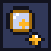

# Loupe brand

Every file here is drawn from code by `scripts/brand.ts`, on a pixel grid. To change one, edit the script or `palette.json`, then run `node scripts/brand.ts`. A test fails if a file and the script disagree.

## The mark

A jeweler's loupe, its round lens showing a magnified sparkle of the cut gem below it, on a square tile with a 1-pixel dark outline. It is 16 by 16 pixels: [mark.svg](mark.svg).

## The lockup

The mark and the word. Use [lockup-light.svg](lockup-light.svg) on light pages and [lockup-dark.svg](lockup-dark.svg) on dark ones. An image can't see the page's theme, so a web page picks the file:

<picture>
  <source media="(prefers-color-scheme: dark)" srcset="lockup-dark.svg">
  
</picture>

## Palette

A sibling of Parallax: the same tile and outline, with Loupe's own amber and gold. The colors are in [palette.json](palette.json).

| Name | Hex | Use |
|---|---|---|
| tile | `#313859` | The mark's tile, and the "You" steps in the diagram. Shared with Parallax. |
| outline | `#12131f` | Every 1-pixel outline, and dark text on light pages. Shared with Parallax. |
| amber | `#ffb627` | Bright accent: the gem, the loupe's band and the "Loupe" steps. Use on the tile or on dark pages, never on white. |
| gold | `#a86f0c` | Deep accent: the loupe's body and the "Automatic" steps. Reads on light and dark pages. |
| glass | `#c9d3f0` | The loupe's lens, and box edges on dark pages. |
| white | `#ffffff` | Glints in the mark, and text on the tile or on gold. |
| cream | `#f4efe3` | Text on dark pages. |

Bright amber reads on the tile and on dark pages, but not on white. Deep gold reads on both light and dark pages. A test checks each of these pairs.
